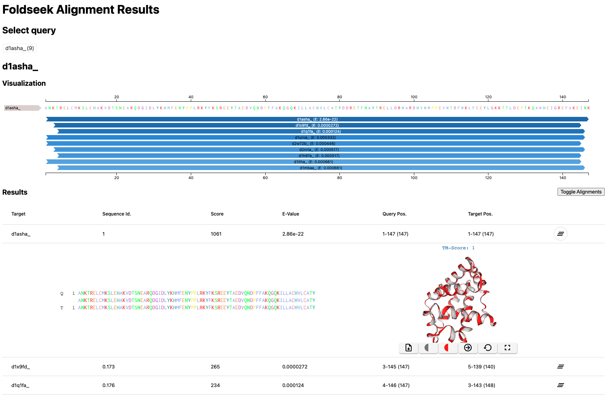

# Foldseek 
Foldseek enables fast and sensitive comparisons of large protein structure sets, supporting monomer and multimer searches, as well as clustering. It runs on CPU, supports GPU acceleration for faster searches, and optionally allows ultra-fast and sensitive comparisons directly from protein sequence inputs using a language model, bypassing the need for structures.
<p align="center"></p>

## Publications
[van Kempen M, Kim S, Tumescheit C, Mirdita M, Lee J, Gilchrist CLM, Söding J, and Steinegger M. Fast and accurate protein structure search with Foldseek. Nature Biotechnology, doi:10.1038/s41587-023-01773-0 (2023)](https://www.nature.com/articles/s41587-023-01773-0)

[Barrio-Hernandez I, Yeo J, Jänes J, Mirdita M, Gilchrist CLM, Wein T, Varadi M, Velankar S, Beltrao P and Steinegger M. Clustering predicted structures at the scale of the known protein universe. Nature, doi:10.1038/s41586-023-06510-w (2023)](https://www.nature.com/articles/s41586-023-06510-w)

[Kim W, Mirdita M, Levy Karin E, Gilchrist CLM, Schweke H, Söding J, Levy E, and Steinegger M. Rapid and sensitive protein complex alignment with Foldseek-Multimer. Nature Methods, doi:10.1038/s41592-025-02593-7 (2025)](https://www.nature.com/articles/s41592-025-02593-7)

[Kallenborn F, Chacon A, Hundt C, Sirelkhatim H, Didi K, Cha S, Dallago C, Mirdita M, Schmidt B, Steinegger M: GPU-accelerated homology search with MMseqs2. bioRxiv, doi: 10.1101/2024.11.13.623350 (2024)](https://www.biorxiv.org/content/10.1101/2024.11.13.623350v1)

# Table of Contents

- [Foldseek](#foldseek)
  - [Publications](#publications)
- [Table of Contents](#table-of-contents)
  - [Webserver](#webserver)
  - [Installation](#installation)
  - [Memory requirements](#memory-requirements)
  - [Tutorial Video](#tutorial-video)
  - [Documentation](#documentation)
  - [Quick start](#quick-start)
    - [Search](#search)
      - [Output Search](#output-search)
        - [Tab-separated](#tab-separated)
        - [Superpositioned Cα only PDB files](#superpositioned-cα-only-pdb-files)
        - [Interactive HTML](#interactive-html)
      - [Important search parameters](#important-search-parameters)
      - [Alignment Mode](#alignment-mode)
    - [Databases](#databases)
      - [Create custom databases and indexes](#create-custom-databases-and-indexes)
      - [Create custom database from protein sequence (FASTA)](#create-custom-database-from-protein-sequence-fasta)
      - [Pad database for fast GPU search](#pad-database-for-fast-gpu-search)
    - [Cluster](#cluster)
      - [Output Cluster](#output-cluster)
        - [Tab-separated cluster](#tab-separated-cluster)
        - [Representative fasta](#representative-fasta)
        - [All member fasta](#all-member-fasta)
      - [Important cluster parameters](#important-cluster-parameters)
    - [Multimersearch](#multimersearch)
      - [Using Multimersearch](#using-multimersearch)
      - [Multimer Search Output](#multimer-search-output)
        - [Tab-separated-complex](#tab-separated-complex)
        - [Complex Report](#complex-report)
    - [Multimercluster](#multimercluster)
      - [Output MultimerCluster](#output-multimercluster)
        - [Tab-separated multimercluster](#tab-separated-multimercluster)
        - [Representative multimer fasta](#representative-multimer-fasta)
        - [Filtered search result](#filtered-search-result)
      - [Important multimer cluster parameters](#important-multimer-cluster-parameters)
  - [Main Modules](#main-modules)
  - [Examples](#examples)
    - [Faster Search with GPU Acceleration](#faster-search-with-gpu-acceleration)
    - [Fast Structure Search from FASTA input](#fast-structure-search-from-fasta-input)
    - [Rescore aligments using TMscore](#rescore-aligments-using-tmscore)
    - [Query centered multiple sequence alignment](#query-centered-multiple-sequence-alignment)

## Webserver 
Search your protein structures against the [AlphaFoldDB](https://alphafold.ebi.ac.uk/) and [PDB](https://www.rcsb.org/) in seconds using the Foldseek webserver ([code](https://github.com/soedinglab/mmseqs2-app)): [search.foldseek.com](https://search.foldseek.com) 🚀

## Installation
```
# Linux AVX2 build (check using: cat /proc/cpuinfo | grep avx2)
wget https://mmseqs.com/foldseek/foldseek-linux-avx2.tar.gz; tar xvzf foldseek-linux-avx2.tar.gz; export PATH=$(pwd)/foldseek/bin/:$PATH

# Linux ARM64 build
wget https://mmseqs.com/foldseek/foldseek-linux-arm64.tar.gz; tar xvzf foldseek-linux-arm64.tar.gz; export PATH=$(pwd)/foldseek/bin/:$PATH

# Linux AVX2 & GPU build (req. glibc >= 2.17 and nvidia driver >=525.60.13)
wget https://mmseqs.com/foldseek/foldseek-linux-gpu.tar.gz; tar xvfz foldseek-linux-gpu.tar.gz; export PATH=$(pwd)/foldseek/bin/:$PATH

# MacOS
wget https://mmseqs.com/foldseek/foldseek-osx-universal.tar.gz; tar xvzf foldseek-osx-universal.tar.gz; export PATH=$(pwd)/foldseek/bin/:$PATH

# Conda installer (Linux and macOS)
conda install -c conda-forge -c bioconda foldseek
```
Other precompiled binaries are available at [https://mmseqs.com/foldseek](https://mmseqs.com/foldseek).

> [!NOTE]
> We recently added support for GPU-accelerated protein sequence and profile searches. This requires an NVIDIA GPU of the Ampere generation or newer for full speed, however, also works at reduced speed for Turing-generation GPUs. The bioconda- and precompiled binaries will not work on older GPU generations (e.g. Volta or Pascal).

## Memory requirements 
For optimal software performance, consider three options based on your RAM and search requirements:

1. **With Cα info (default).** 
   Use this formula to calculate RAM - `(6 bytes Cα + 1 3Di byte + 1 AA byte) * (database residues)`. The 54M AFDB50 entries require 151GB.

2. **Without Cα info.** 
   By disabling `--sort-by-structure-bits 0`, RAM requirement reduces to 35GB. However, this alters hit rankings and final scores but not E-values. Structure bits are mostly relevant for hit ranking for E-value > 10^-1.

3. **Single query searches.** 
   Use the `--prefilter-mode 1`, which isn't memory-limited and computes all optimal ungapped alignments. This option optimally utilizes foldseek's multithreading capabilities for single queries and supports GPU acceleration.

## Tutorial Video
A Foldseek tutorial covering the webserver and command-line usage is available [here](https://www.youtube.com/watch?v=k5Rbi22TtOA). <a href="https://www.youtube.com/watch?v=k5Rbi22TtOA"></a>

## Documentation
Many of Foldseek's modules (subprograms) rely on MMseqs2. For more information about these modules, refer to the [MMseqs2 wiki](https://github.com/soedinglab/MMseqs2/wiki). For documentation specific to Foldseek, checkout the Foldseek wiki [here](https://github.com/steineggerlab/foldseek/wiki).

## Quick start

### Search
The `easy-search` module allows to query one or more single-chain proteins, formatted in as protein structures in PDB/mmCIF format (flat or gzipped) or as protein sequnece in [fasta](#create-custom-database-from-protein-sequence-fasta), against a target database, folder or individual single-chain protein structures (for multi-chain proteins see [complexsearch](#complexsearch)). The default alignment information output is a [tab-separated file](#tab-separated) but Foldseek also supports [Superposed Cα PDBs](#superpositioned-cα-only-pdb-files) and [HTML](#interactive-html).

    foldseek easy-search example/d1asha_ example/ aln tmpFolder
    
#### Output Search
##### Tab-separated
  
The default output fields are: `query,target,fident,alnlen,mismatch,gapopen,qstart,qend,tstart,tend,evalue,bits` but they can be customized with the `--format-output` option e.g., `--format-output "query,target,qaln,taln"` returns the query and target accessions and the pairwise alignments in tab-separated format. You can choose many different output columns.

| Code | Description |
| --- | --- |
|query | Query sequence identifier |
|target | Target sequence identifier |
|qca        | Calpha coordinates of the query |
|tca        | Calpha coordinates of the target |
|alntmscore | TM-score of the alignment | 
|qtmscore   | TM-score normalized by the query length |
|ttmscore   | TM-score normalized by the target length |
|u          | Rotation matrix (computed to by TM-score) |
|t          | Translation vector (computed to by TM-score) |
|lddt       | Average LDDT of the alignment |
|lddtfull   | LDDT per aligned position |
|prob       | Estimated probability for query and target to be homologous (e.g. being within the same SCOPe superfamily) |

Check out the [MMseqs2 documentation for additional output format codes](https://github.com/soedinglab/MMseqs2/wiki#custom-alignment-format-with-convertalis).

##### Superpositioned Cα only PDB files
Foldseek's `--format-mode 5` generates PDB files with all target Cα atoms superimposed onto the query structure based on the aligned coordinates. 
For each pairwise alignment it will write its own PDB file, so be careful when using this options for large searches. 

##### Interactive HTML
Locally run Foldseek can generate an HTML search result, similar to the one produced by the [webserver](https://search.foldseek.com) by specifying `--format-mode 3`

```
foldseek easy-search example/d1asha_ example/ result.html tmp --format-mode 3
```

<p align="center"></p>

#### Important search parameters

| Option              | Category    | Description                                                                                                                            |
|---------------------|-------------|----------------------------------------------------------------------------------------------------------------------------------------|
| -s                  | Sensitivity | Adjust sensitivity to speed trade-off; lower is faster, higher more sensitive (fast: 7.5, default: 9.5)                                |
| --num-iterations    | Sensitivity | Enables iterative search to find more distantly related hits (Default: off). Recommended `--num-iterations 0` optimized version                        |
| --exhaustive-search | Sensitivity | Skips prefilter and performs an all-vs-all alignment (more sensitive but much slower)                                                  |
| --max-seqs          | Sensitivity | Adjust the amount of prefilter handed to alignment; increasing it can lead to more hits (default: 1000)                                |
| -e                  | Sensitivity | List matches below this E-value (range 0.0-inf, default: 0.001); increasing it reports more distant structures                         |
| --cluster-search     | Sensitivity   | For clustered databases like AFDB50, CATH50 trigger a cluster search: 0: search only representatives (fast), 1: align and report also all members of a cluster (default: 0)                                                           |
| --alignment-type    | Alignment   | 0: 3Di Gotoh-Smith-Waterman (local, not recommended), 1: TMalign (global, slow), 2: 3Di+AA Gotoh-Smith-Waterman (local, default)       |
| -c                  | Alignment   | List matches above this fraction of aligned (covered) residues (see --cov-mode) (default: 0.0); higher coverage = more global alignment |
| --cov-mode          | Alignment   | 0: coverage of query and target, 1: coverage of target, 2: coverage of query                                                           |

| --gpu               | Performance | Enables fast GPU-accelerated ungapped prefilter (`--prefilter-mode 1`) (default: off), ignores `-s`. Use `--gpu 1` to enable.          |

#### Alignment Mode
By default, Foldseek uses its local 3Di+AA structural alignment but it also supports realigning hits using the global TMalign as well as rescoring alignments using TMscore. 

    foldseek easy-search example/d1asha_ example/ aln tmp --alignment-type 1

If alignment type is set to tmalign (`--alignment-type 1`), the results will be sorted by the TMscore normalized by query length. The TMscore is used for reporting two fields: the e-value=(qTMscore+tTMscore)/2 and the score=(qTMscore*100). All output fields (e.g., pident, fident, and alnlen) are calculated based on the TMalign alignment.

### Databases 
The `databases` command downloads pre-generated databases like PDB or AlphaFoldDB.
    
    # pdb  
    foldseek databases PDB pdb tmp 
    # alphafold db
    foldseek databases Alphafold/Proteome afdb tmp 

We currently support the following databases: 
```
  Name                   	Type     	Taxonomy	Url
- Alphafold/UniProt   	Aminoacid	     yes	https://alphafold.ebi.ac.uk/
- Alphafold/UniProt50 	Aminoacid	     yes	https://alphafold.ebi.ac.uk/
- Alphafold/Proteome  	Aminoacid	     yes	https://alphafold.ebi.ac.uk/
- Alphafold/Swiss-Prot	Aminoacid	     yes	https://alphafold.ebi.ac.uk/
- ESMAtlas30          	Aminoacid	       -	https://esmatlas.com
- PDB                 	Aminoacid	     yes	https://www.rcsb.org
```

#### Create custom databases and indexes
The target database can be pre-processed by `createdb`. This is useful when searching multiple times against the same set of target structures. 
 
    foldseek createdb example/ targetDB
    foldseek createindex targetDB tmp  #OPTIONAL generates and stores the index on disk
    foldseek easy-search example/d1asha_ targetDB aln.m8 tmpFolder

#### Create custom database from protein sequence (FASTA)
Create a structural database from FASTA files using the [ProstT5](https://academic.oup.com/nargab/article/6/4/lqae150/7901286) protein language model. It runs by default on CPU and is about 400-4000x compared to predicted structures by [ColabFold](https://github.com/sokrypton/ColabFold).
However, this database will contain only the predicted 3Di structural sequences without additional structural details.
As a result, it supports monomer search and clustering, but does not enable features requiring Cα information, such as `--alignment-type 1`, TM-score or LDDT output.
```
foldseek databases ProstT5 weights tmp
foldseek createdb db.fasta db --prostt5-model weights
```

Accelerate inference by one to two magnitudes using GPU(s) (`--gpu 1`) 

```
foldseek createdb db.fasta db --prostt5-model weights --gpu 1
```
- Use the `CUDA_VISIBLE_DEVICES` variable to select the GPU device(s).
  - `CUDA_VISIBLE_DEVICES=0` to use GPU 0.
  - `CUDA_VISIBLE_DEVICES=0,1` to use GPUs 0 and 1.
 
#### Pad database for fast GPU search
GPU searches require the database to be reformatted, with padding added to each sequence using the `makepaddedseqdb` command. The padded database can be used for both CPU and GPU searches.
```
# Prepare the database for GPU search
foldseek makepaddedseqdb db db_pad
# Perform GPU search
foldseek search db db_pad result_dir --gpu 1
```

### Cluster
The `easy-cluster` algorithm is designed for structural clustering by assigning structures to a representative protein structure using structural alignment. It accepts input in either as protein structures as PDB/mmCIF or protein sequences as [fasta](#create-custom-database-from-protein-sequence-fasta) format, with support for both flat and gzipped files. By default, easy-cluster generates three output files with the following prefixes: (1) `_clu.tsv`, (2) `_repseq.fasta`, and (3) `_allseq.fasta`. The first file (1) is a [tab-separated](#tab-separated-cluster) file describing the mapping from representative to member, while the second file (2) contains only [representative sequences](#representative-fasta), and the third file (3) includes all [cluster member sequences](#all-member-fasta).

    foldseek easy-cluster example/ res tmp -c 0.9 
    
#### Output Cluster
##### Tab-separated cluster
The provided format represents protein structure clustering in a tab-separated, two-column layout (representative and member). Each line denotes a cluster-representative and cluster-member relationship, signifying that the member shares significant structural similarity with the representative, and thus belongs to the same cluster.
```
Q0KJ32	Q0KJ32
Q0KJ32	C0W539
Q0KJ32	D6KVP9
E3HQM9	E3HQM9
E3HQM9	F0YHT8
```

##### Representative fasta
The `_repseq.fasta` contains all representative protein sequences of the clustering.
```
>Q0KJ32
MAGA....R
>E3HQM9
MCAT...Q
```

##### All member fasta
In the `_allseq.fasta` file all sequences of the cluster are present. A new cluster is marked by two identical name lines of the representative sequence, where the first line stands for the cluster and the second is the name line of the first cluster sequence. It is followed by the fasta formatted sequences of all its members.

```
>Q0KJ32	
>Q0KJ32
MAGA....R
>C0W539
MVGA....R
>D6KVP9
MVGA....R
>E3HQM9	
>E3HQM9
MCAT...Q
>Q223C0
MCAR...Q
```

#### Important cluster parameters

| Option                   | Category    | Description                                                                                                                                 |
|--------------------------|-------------|---------------------------------------------------------------------------------------------------------------------------------------------|
| -e                       | Sensitivity | List matches below this E-value (range 0.0-inf, default: 0.001); increasing it reports more distant structures                              |
| --alignment-type         | Alignment   | 0: 3Di Gotoh-Smith-Waterman (local, not recommended), 1: TMalign (global, slow), 2: 3Di+AA Gotoh-Smith-Waterman (local, default)            |
| -c                       | Alignment   | List matches above this fraction of aligned (covered) residues (see --cov-mode) (default: 0.0); higher coverage = more global alignment     |
| --cov-mode               | Alignment   | 0: coverage of query and target, 1: coverage of target, 2: coverage of query                                                                |
| --min-seq-id             | Alignment   | the minimum sequence identity to be clustered                                                                                               |
| --tmscore-threshold      | Alignment   | accept alignments with an alignment TMscore > thr                                                                                           |
| --tmscore-threshold-mode | Alignment   | normalize TMscore by 0: alignment, 1: representative, 2: member length                                                                      |
| --lddt-threshold         | Alignment   | accept alignments with an alignment LDDT score > thr                                                                                        |

### Multimersearch
The `easy-multimersearch` module is designed for querying one or more protein complex (multi-chain) structures (supported input formats: PDB/mmCIF, flat or gzipped) against a target database of protein complex structures. It reports the similarity metrices between the complexes (e.g., the TMscore).

#### Using Multimersearch
The examples below use files that can be found in the `example` directory, which is part of the Foldseek repo, if you clone it. 
If you use the precompiled version of the software, you can download the files directly: [1tim.pdb.gz](https://github.com/steineggerlab/foldseek/raw/master/example/1tim.pdb.gz) and [8tim.pdb.gz](https://github.com/steineggerlab/foldseek/raw/master/example/8tim.pdb.gz).

For a pairwise alignment of complexes using `easy-multimersearch`, run the following command:
```
foldseek easy-multimersearch example/1tim.pdb.gz example/8tim.pdb.gz result tmpFolder
```
Foldseek `easy-multimersearch` can also be used for searching one or more query complexes against a target database: 
```
foldseek databases PDB pdb tmp 
foldseek easy-multimersearch example/1tim.pdb.gz pdb result tmpFolder
```

#### Multimer Search Output
##### Tab-separated-complex
By default, `easy-multimersearch` reports the output alignment in a tab-separated file.
The default output fields are: `query,target,fident,alnlen,mismatch,gapopen,qstart,qend,tstart,tend,evalue,bits,complexassignid` but they can be customized with the `--format-output` option e.g., `--format-output "query,target,complexqtmscore,complexttmscore,complexassignid"` alters the output to show specific scores and identifiers.

| Code | Description |
| --- | --- |
| **Commons** |
|query | Query sequence identifier |
|target | Target sequence identifier |
| **Only for scorecomplex** |
|complexqtmscore| TM-score of Complex alignment normalized by the query length |
|complexttmscore| TM-score of Complex alignment normalized by the target length |
|complexu       | Rotation matrix of Complex alignment (computed to by TM-score) |
|complext       | Translation vector of Complex alignment (computed to by TM-score) |
|complexassignid| Index of Complex alignment |

**Example Output:**
```
1tim.pdb.gz_A   8tim.pdb.gz_A   0.967   247 8   0   1   247 1   247 5.412E-43   1527    0
1tim.pdb.gz_B   8tim.pdb.gz_B   0.967   247 8   0   1   247 1   247 1.050E-43   1551    0
```

##### Complex Report
`easy-multimersearch` also generates a report (prefixed `_report`), which provides a summary of the inter-complex chain matching, including identifiers, chains, TMscores, rotation matrices, translation vectors, and assignment IDs. The report includes the following fields:
| Column | Description |
| --- | --- |
| 1 | Identifier of the query complex |
| 2 | Identifier of the target complex |
| 3 | Comma separated matched chains in the query complex |
| 4 | Comma separated matched chains in the target complex |
| 5 | TM score normalized by query length [0-1] |
| 6 | TM score normalized by target length [0-1] |
| 7 | Comma separated nine rotation matrix (U) values |
| 8 | Comma separated three translation vector (T) values |
| 9 | Complex alignment ID |

**Example Output:**
```
1tim.pdb.gz 8tim.pdb.gz A,B A,B 0.98941 0.98941 0.999983,0.000332,0.005813,-0.000373,0.999976,0.006884,-0.005811,-0.006886,0.999959 0.298992,0.060047,0.565875  0
```

### Multimercluster
The `easy-multimercluster` module is designed for multimer-level structural clustering(supported input formats: PDB/mmCIF, flat or gzipped). By default, easy-multimercluster generates three output files with the following prefixes: (1) `_cluster.tsv`, (2) `_rep_seq.fasta` and (3) `_cluster_report`.  The first file (1) is a [tab-separated](#tab-separated-multimercluster) file describing the mapping from representative multimer to member, while the second file (2) contains only [representative sequences](#representative-multimer-fasta). The third file (3) is also a [tab-separated](#filtered-search-result) file describing filtered alignments.

Make sure chain names in PDB/mmcIF files does not contain underscores(_).

    foldseek easy-multimercluster example/ clu tmp --multimer-tm-threshold 0.65 --chain-tm-threshold 0.5 --interface-lddt-threshold 0.65

#### Output MultimerCluster
##### Tab-separated multimercluster
```
5o002	   5o002
194l2	   194l2
194l2	   193l2
10mh121	 10mh121
10mh121	 10mh114
10mh121	 10mh119
```
##### Representative multimer fasta
```
#5o002
>5o002_A
SHGK...R
>5o002_B
SHGK...R
#194l2
>194l2_A0
KVFG...L
>194l2_A6
KVFG...L
#10mh121
...
```
##### Filtered search result
The `_cluster_report` contains `qcoverage, tcoverage, multimer qTm, multimer tTm, interface lddt, ustring, tstring` of alignments after filtering and before clustering. 
```
5o0f2	5o0f2	1.000	1.000	1.000	1.000	1.000	1.000,0.000,0.000,0.000,1.000,0.000,0.000,0.000,1.000	0.000,0.000,0.000
5o0f2	5o0d2	1.000	1.000	0.999	0.992	1.000	0.999,0.000,-0.000,-0.000,0.999,-0.000,0.000,0.000,0.999	-0.004,-0.001,0.084
5o0f2	5o082	1.000	0.990	0.978	0.962	0.921	0.999,-0.025,-0.002,0.025,0.999,-0.001,0.002,0.001,0.999	-0.039,0.000,-0.253
```
The query and target coverages here represent the sum of the coverages of all aligned chains, divided by the total query and target multimer length respectively.

#### Important multimer cluster parameters

| Option                     | Category    | Description                                                                                                                             |
|----------------------------|-------------|-----------------------------------------------------------------------------------------------------------------------------------------|
| -e                         | Sensitivity | List matches below this E-value (range 0.0-inf, default: 0.001); increasing it reports more distant structures                          |
| --alignment-type           | Alignment   | 0: 3Di Gotoh-Smith-Waterman (local, not recommended), 1: TMalign (global, slow), 2: 3Di+AA Gotoh-Smith-Waterman (local, default)        |
| -c                         | Alignment   | List matches above this fraction of aligned (covered) residues (see --cov-mode) (default: 0.0); higher coverage = more global alignment |
| --cov-mode                 | Alignment   | 0: coverage of query and target (cluster multimers only with same chain numbers), 1: coverage of target, 2: coverage of query           |
| --multimer-tm-threshold    | Alignment   | accept alignments with multimer alignment TMscore > thr                                                                                 |
| --chain-tm-threshold       | Alignment   | accept alignments if every single chain TMscore > thr                                                                                   |
| --interface-lddt-threshold | Alignment   | accept alignments with an interface LDDT score > thr                                                                                    |

## Main Modules
- `easy-search`       fast protein structure search  
- `easy-cluster`      fast protein structure clustering  
- `easy-multimersearch`       fast protein multimer-level structure search  
- `easy-multimercluster`       fast protein multimer-level structure clustering  
- `createdb`          create a database from protein structures (PDB,mmCIF, mmJSON)
- `databases`         download pre-assembled databases

## Examples
#### Faster Search with GPU Acceleration
Foldseek's prefilter on a 4090 GPU is four times faster than a 64-core CPU. To use GPU-based ungapped alignment for faster prefiltering, ensure you have a CUDA-enabled GPU and specify the `--gpu` option:
```
foldseek easy-search example/d1asha_ example/ aln tmp --gpu 1 --prefilter-mode 1
```
- Use the `CUDA_VISIBLE_DEVICES` variable to select the GPU device(s).
  - `CUDA_VISIBLE_DEVICES=0` to use GPU 0.
  - `CUDA_VISIBLE_DEVICES=0,1` to use GPUs 0 and 1.

#### Fast structure search from FASTA input
Protein sequences can be directly searched without requiring existing protein structures by using [ProstT5](https://academic.oup.com/nargab/article/6/4/lqae150/7901286), which is approximately 400–4000x faster than predicting structures with ColabFold.
Read more [here](#create-custom-database-from-protein-sequence-fasta).
```
foldseek databases ProstT5 weights tmp
foldseek databases PDB pdb tmp
foldseek easy-search QUERY.fasta pdb res.m8 tmp --prostt5-model weights
```
The translation with ProstT5 can be accelerated by using GPU(s) (`--gpu 1`) and multiple GPUs can be used by setting the `CUDA_VISIBLE_DEVICES` variable.


### Rescore aligments using TMscore
The easiest way to get the alignment TMscore normalized by min(alnLen,qLen,targetLen) as well as a rotation matrix is through the following command:
```
foldseek easy-search example/ example/ aln tmp --format-output query,target,alntmscore,u,t
```

Alternatively, it is possible to compute TMscores for the kind of alignment output (e.g., 3Di+AA) using the following commands: 
```
foldseek createdb example/ targetDB
foldseek createdb example/ queryDB
foldseek search queryDB targetDB aln tmpFolder -a
foldseek aln2tmscore queryDB targetDB aln aln_tmscore
foldseek createtsv queryDB targetDB aln_tmscore aln_tmscore.tsv
```

Output format `aln_tmscore.tsv`: query and target identifiers, TMscore, translation(3) and rotation vector=(3x3)

### Query centered multiple sequence alignment 
Foldseek can output multiple sequence alignments in a3m format using the following commands. 
To convert a3m to FASTA format, the following script can be used [reformat.pl](https://raw.githubusercontent.com/soedinglab/hh-suite/master/scripts/reformat.pl) (`reformat.pl in.a3m out.fas`).

```
foldseek createdb example/ targetDB
foldseek createdb example/ queryDB
foldseek search queryDB targetDB aln tmpFolder -a
foldseek result2msa queryDB targetDB aln msa --msa-format-mode 6
foldseek unpackdb msa msa_output --unpack-suffix a3m --unpack-name-mode 0
```
For a non-query centered multiple sequence alignment please check out [Foldmason](https://github.com/steineggerlab/foldmason).
